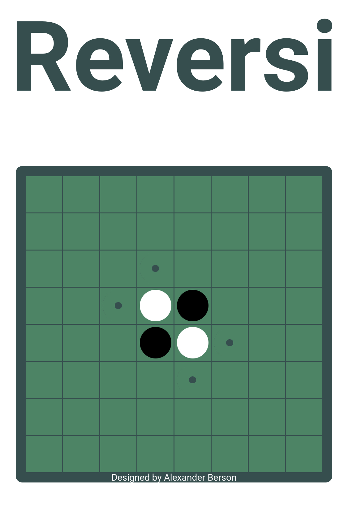

# Reversi

Get more disks of your color than your opponent.  
You can [play Reversi against the AI online](https://alex-berson.github.io/reversi/) or  

## Description

**Reversi**, also known as **Othello**, is a strategy board game for two players, played on an 8×8 uncheckered board.

There are sixty-four identical game pieces called disks (often spelled "discs"), which are white on one side and black on the other. The game begins with four disks placed in a square in the middle of the board, two facing white-side-up, two black-side-up, so that the same-colored disks are on a diagonal. By convention, black-side-up disks are to the north-east and south-west (from both players' perspectives). The black player moves first.

Players take alternate turns placing disks on the board with their assigned color facing up. During a play, any disks of the opponent's color that are in a straight line and bounded by the disk just placed and another disk of the current player's color are turned over to the current player's color.

A valid move is one where at least one disk is reversed (flipped over). If one player cannot make a valid move, play passes back to the other player. When neither player can move, the game ends. This occurs when the board has filled up or when neither player can legally place a disk in any of the remaining squares.

The player with the most disks on the board at the end of the game wins.

## Screenshot

  

## License

Copyright &copy; 2022-2024 Alexander Berson. This project is licensed under the [MIT license](LICENSE.txt "MIT License").